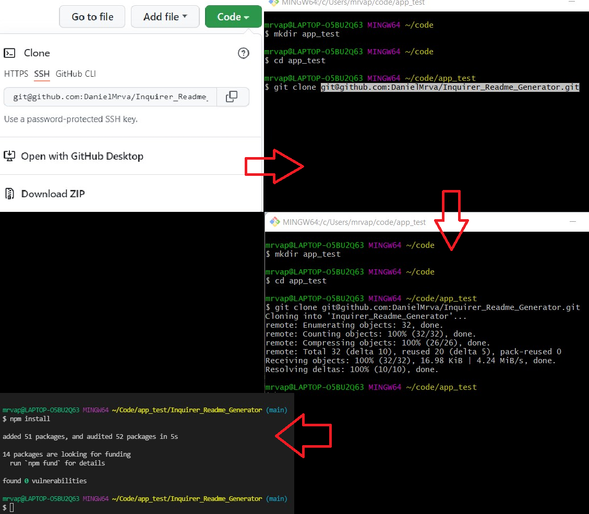
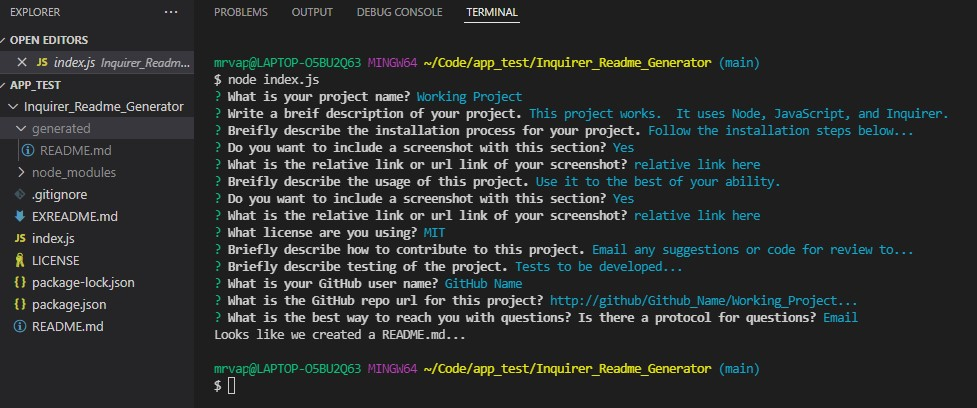

# [Inquirer Readme Generator](https://github.com/DanielMrva/Inquirer_Readme_Generator) 
  
  ## Description
  Inquirer README Generator is a basic JavaScript command-line README generator to help in creating professional README.md for projects.  The technologies used include: JavaScript, Node, and Inquirer. 
  
  License badges are from https://shields.io/

  ## Table of Conents
   1. [Installation](#installation)
   1. [Usage](#usage)
   1. [Contribution](#contribution)
   1. [Tests](#tests)
   1. [Questions](#questions)
   1. [Github Repository](#github-repository)
   1. [License](#license)
  
  ## Installation
  Open github link, click on "Code" button, and copy repo link. 

  In Bash navigate to desired parent directory and type "git clone" then paste the repo link.

  Open project in Node terminal or code editor and run "npm intall" to install Inquirer dependency.

  
  
  ## Usage 
  Run "node index.js" to run the app.  
  The prompts will guide you through the basic structure for a README. se relative links or urls for images. 
  The README should be saved in a folder generated by the app named after the project. 
  Remember to auidit all relative links for images after moving the README to the desired directory.

  

  ## Contribution
  If you have any suggestions or modifications, please email them to the links below.
  
  ## Tests
  Testing is still in development for this project. 
  
  ## Questions
  You can email me with questions or suggestions at the provided email.

  Feel free to follow or contact me at my GitHub page: [DanielMrva](https://github.com/DanielMrva)
  
  
  ## Github Repository
  [Inquiirer Readme Generator](https://github.com/DaielMrva/Inquirer_Readme_Generator)
  
  ## License 
  MIT
